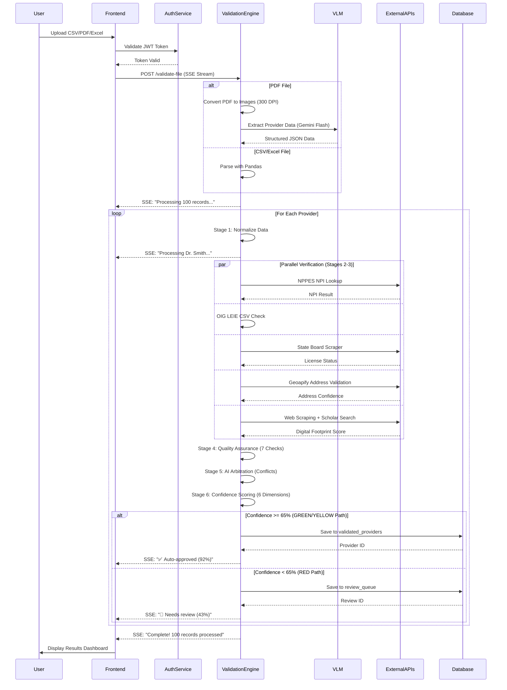
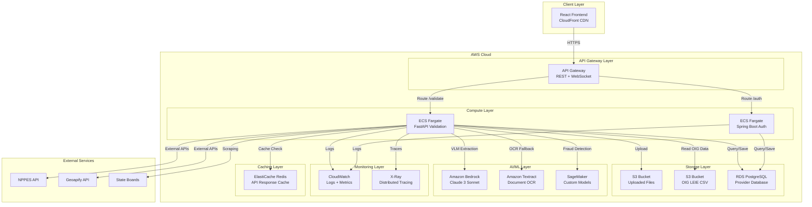

# Health Atlas - System Design Document

**Version:** 2.1  
**Date:** February 14, 2026  
**Document Type:** Technical Design Specification

---

## 1. Executive Summary

Health Atlas is an autonomous AI-powered healthcare provider validation system built on a microservices architecture. The system processes scanned PDFs, CSV files, and images through a 7-stage validation pipeline, leveraging Vision Language Models (VLMs), multi-agent orchestration, and real-time streaming to validate provider credentials at scale.

### Key Design Principles
- **Microservices Architecture**: Separation of concerns across authentication, validation, and presentation layers
- **Event-Driven Processing**: Asynchronous validation with real-time progress streaming
- **AI-First Approach**: Vision models for document extraction, LLMs for conflict resolution
- **Scalability**: Parallel processing with configurable worker pools
- **Resilience**: Multi-tier fallback mechanisms for external API failures

---

## 2. System Architecture

### 2.1 High-Level Architecture Overview

Health Atlas consists of three primary services communicating over HTTP/WebSocket protocols:

```
┌─────────────────────────────────────────────────────────────────┐
│                    CLIENT LAYER (Browser)                       │
│                                                                 │
│  React 18 + Vite + Tailwind CSS                                │
│  - File Upload Interface                                        │
│  - Real-time Validation Dashboard                              │
│  - Provider Search & Analytics                                 │
│  - 3D Globe Visualization                                      │
└────────────┬────────────────────────────────────────────────────┘
             │
             │ HTTP/SSE (Port 5173 → 8000/8080)
             │
     ┌───────┴────────┬──────────────────────┐
     │                │                      │
     ▼                ▼                      ▼
┌──────────────────┐   ┌──────────────────┐   ┌──────────────────┐
│  SPRING BOOT     │   │  PYTHON/FASTAPI  │   │  NEON POSTGRESQL │
│  AUTH SERVICE    │   │  VALIDATION      │   │  DATABASE        │
│  Port 8080       │   │  ENGINE          │   │  (Cloud)         │
│                  │   │  Port 8000       │   │                  │
│ • JWT Auth       │   │                  │   │ • Providers      │
│ • User Mgmt      │◄──┤ • Multi-Agent    │◄──┤ • Review Queue   │
│ • RBAC           │   │   Pipeline       │   │ • Audit Logs     │
│ • BCrypt Hash    │   │ • VLM Extract    │   │ • History        │
└──────────────────┘   │ • Real-time SSE  │   └──────────────────┘
                       └────────┬─────────┘
                                │
                                │ External APIs
                                │
        ┌───────────────────────┼────────────────────────┐
        │                       │                        │
        ▼                       ▼                        ▼
┌──────────────┐      ┌──────────────┐      ┌──────────────┐
│ NPPES API    │      │ OIG LEIE CSV │      │ State Boards │
│ (CMS)        │      │ (Local)      │      │ (Scrapers)   │
└──────────────┘      └──────────────┘      └──────────────┘
        │                       │                        │
        ▼                       ▼                        ▼
┌──────────────┐      ┌──────────────┐      ┌──────────────┐
│ Geoapify     │      │ Google Maps  │      │ Gemini Flash │
│ (Address)    │      │ (Places)     │      │ (VLM)        │
└──────────────┘      └──────────────┘      └──────────────┘
```

### 2.2 Component Responsibilities

**Frontend (React 18 + Vite)**
- User interface for file uploads (CSV, PDF, Excel, Images)
- Real-time validation progress display via Server-Sent Events
- Provider search and filtering
- Analytics dashboards with 3D visualizations
- PDF report generation

**Authentication Service (Spring Boot 3.2)**
- JWT token generation and validation
- User registration and login
- Role-based access control (RBAC)
- Password hashing with BCrypt
- Session management

**Validation Engine (Python 3.10 + FastAPI)**
- Multi-agent orchestration using LangGraph
- Vision Language Model (VLM) extraction from documents
- 7-stage validation pipeline execution
- Real-time progress streaming via SSE
- Parallel processing with worker pools
- Database persistence

**Database (Neon PostgreSQL)**
- Validated provider records
- Review queue for human oversight
- Verification history (audit trail)
- API usage logs

---

## 3. Technology Stack

### 3.1 Backend Technologies

**Python 3.10+**
- Primary language for validation engine
- Chosen for rich ecosystem of AI/ML libraries
- Async/await support for concurrent processing

**FastAPI**
- Modern async web framework
- Automatic OpenAPI documentation
- Native support for Server-Sent Events (SSE)
- High performance (comparable to Node.js)

**LangGraph**
- Multi-agent orchestration framework
- Stateful workflow management
- Built on LangChain for LLM integration

**LangChain**
- LLM abstraction layer
- Tool calling and function execution
- Prompt management

**Key Python Libraries:**
- `pandas`: CSV/Excel data manipulation
- `PyPDF2`: PDF text extraction
- `pdf2image`: PDF to image conversion
- `Pillow (PIL)`: Image preprocessing
- `selenium`: Web scraping with Edge browser
- `beautifulsoup4`: HTML parsing
- `psycopg2`: PostgreSQL database driver
- `sqlalchemy`: ORM for database operations
- `thefuzz`: Fuzzy string matching for address comparison
- `usaddress`: Address parsing and normalization
- `python-dotenv`: Environment variable management
- `pydantic`: Data validation and serialization

**AI/ML Libraries:**
- `google-generativeai`: Gemini Flash 2.0 VLM (primary)
- `openai`: GPT-4o-mini (fallback VLM)
- `anthropic`: Claude Haiku (tertiary fallback)
- `langchain-groq`: Llama 3.1 for arbitration

### 3.2 Authentication Service

**Spring Boot 3.2**
- Enterprise-grade Java framework
- Production-ready features (health checks, metrics)
- Extensive security ecosystem

**Java 17+**
- Long-term support (LTS) version
- Modern language features
- Strong typing for security-critical code

**Key Dependencies:**
- `spring-boot-starter-security`: Security framework
- `spring-boot-starter-data-jpa`: Database ORM
- `jjwt`: JWT token generation/validation
- `bcrypt`: Password hashing
- `postgresql`: Database driver

### 3.3 Frontend Technologies

**React 18**
- Component-based UI architecture
- Virtual DOM for performance
- Hooks for state management
- Server-Sent Events (SSE) support

**Vite**
- Next-generation build tool
- Hot Module Replacement (HMR)
- Fast cold starts
- Optimized production builds

**Tailwind CSS 3**
- Utility-first CSS framework
- Responsive design system
- Custom design tokens
- JIT (Just-In-Time) compilation

**Key Libraries:**
- `react-router-dom`: Client-side routing
- `axios`: HTTP client with interceptors
- `react-query` / `zustand`: State management
- `jsPDF`: PDF report generation
- `recharts` / `d3.js`: Data visualization
- `three.js` / `react-globe.gl`: 3D globe visualization

### 3.4 Database

**Neon PostgreSQL**
- Serverless PostgreSQL
- Automatic scaling
- Branching for development
- Built-in connection pooling
- 99.95% uptime SLA

**Schema Design:**
- `validated_providers`: Main provider records
- `review_queue`: Human review workflow
- `verification_history`: Audit trail
- `data_source_logs`: API usage tracking

### 3.5 External APIs & Services

**Vision Language Models:**
- Google Gemini Flash 2.0 (Primary) - FREE tier, 1500 req/day
- OpenAI GPT-4o-mini (Fallback) - $0.15/1M tokens
- Anthropic Claude Haiku (Tertiary) - $0.25/1M tokens

**Healthcare Data Sources:**
- NPPES NPI Registry API (CMS) - FREE, 1000 req/day
- OIG LEIE Database - Local CSV, unlimited
- State Medical Board Scrapers - Custom implementations

**Geospatial Services:**
- Geoapify Geocoding API - FREE tier, 3000 req/day
- Google Maps Places API - Paid, $17/1000 requests

**Search & Enrichment:**
- Serper API (Google Search) - $50/1000 queries
- Google Scholar - Web scraping (rate-limited)

---

## 4. Data Flow Architecture

### 4.1 End-to-End Data Flow



### 4.2 Detailed Stage-by-Stage Flow

**Stage 0: Vision Language Model Extraction (PDF/Images Only)**

```
Input: Scanned PDF / Image File
  ↓
Convert to High-Res Images (300 DPI)
  ↓
Preprocess: Resize, Enhance Sharpness/Contrast
  ↓
Primary: Gemini Flash 2.0 Extraction
  ↓ (if fails)
Fallback 1: GPT-4o-mini
  ↓ (if fails)
Fallback 2: Claude Haiku
  ↓
Output: Structured JSON {providers: [...]}
```

**Stage 1: Data Normalization**

```
Input: Raw Provider Data (CSV/VLM Output)
  ↓
Normalize Field Names (full_name, NPI, specialty, etc.)
  ↓
Validate Required Fields (full_name must exist)
  ↓
Parse Provider Name (extract first/last name)
  ↓
Output: AgentState with initial_data
```

**Stages 2-3: Parallel Verification (Fan-Out)**

```
                    ┌─→ NPPES API (NPI Verification)
                    │   • Match confidence: 0.0-1.0
                    │   • Taxonomy codes
                    │   • Enumeration type
                    │
                    ├─→ OIG LEIE CSV (Exclusion Check)
                    │   • Federal exclusion status
                    │   • Exclusion details
                    │
AgentState ────────┼─→ State Medical Board (License)
                    │   • License status (Active/Suspended/Revoked)
                    │   • Expiration date
                    │   • Disciplinary actions
                    │
                    ├─→ Geoapify + Google Maps (Address)
                    │   • USPS validation
                    │   • Medical facility verification
                    │   • Geo-fraud detection
                    │
                    └─→ Web Enrichment (Digital Footprint)
                        • Website scraping (credentials)
                        • Google Scholar (publications)
                        • Web presence score (0.0-1.0)
                        ↓
                    Merge Results (Fan-In)
```

**Stage 4: Surgical Quality Assurance**

```
7 Automated Checks:
  1. OIG Exclusion → CRITICAL if excluded
  2. License Status → CRITICAL if Suspended/Revoked
  3. Geo-Verification → WARNING if residential address
  4. Cross-Field Consistency → WARNING if specialty mismatch
  5. License-Address Alignment → WARNING if state mismatch
  6. Digital Footprint → INFO if score < 0.3 (zombie)
  7. Address Auto-Healing → INFO if fuzzy match > 85%
  ↓
Output: qa_flags[], fraud_indicators[], qa_corrections{}
```

**Stage 5: AI-Powered Arbitration**

```
Conflicting Data Detected?
  ↓ YES
Invoke LLM (Groq Llama 3.1)
  ↓
Apply Source Authority Hierarchy:
  • State Medical Board: 100
  • NPPES API: 90
  • OIG LEIE: 85
  • Google Business: 70
  • Provider Website: 60
  • CSV Upload: 40
  ↓
Fuzzy Match Similarity > 85%?
  ↓ YES → Auto-Correct to Highest Authority
  ↓ NO → Flag for Human Review
  ↓
Output: golden_record{}
```

**Stage 6: 6-Dimension Confidence Scoring**

```
Calculate Weighted Score:
  • Primary Source Verification (35%)
    - NPI match (50%) + License active (30%) + OIG clear (20%)
  • Address Reliability (20%)
    - USPS confidence + Medical facility flag
  • Digital Footprint (15%)
    - Web presence score (0-1)
  • Data Completeness (15%)
    - Required fields / Total fields
  • Freshness (10%)
    - 1.0 - (days_old / 365), min 0.1
  • Fraud Risk Penalty (5%)
    - Deductions for red flags (max -0.05)
  ↓
Final Score = Σ(dimension × weight)
  ↓
Classify Tier:
  • 90-100%: PLATINUM (Auto-approve)
  • 65-89%: GOLD (Auto-approve with monitoring)
  • 0-64%: QUESTIONABLE (Human review)
```

**Stage 7: Routing Decision**

```
Confidence Score >= 65%?
  ↓ YES (GREEN/YELLOW Path)
  Save to validated_providers table
  Create verification_history entry
  Stream success to frontend
  ↓
  ↓ NO (RED Path)
  Save to review_queue table
  Set priority (HIGH if fraud indicators)
  Stream review needed to frontend
```

---

## 5. AWS Integration Architecture

### 5.1 Current Architecture (Local/Cloud Hybrid)

The current system runs with:
- Frontend: Vercel (or local dev)
- Backend: Railway / Local
- Database: Neon PostgreSQL (cloud)
- APIs: External services (Gemini, NPPES, etc.)

### 5.2 Proposed AWS Migration Architecture



### 5.3 AWS Service Mapping

**Amazon S3 (Simple Storage Service)**

Use Cases:
1. **Uploaded File Storage** (`s3://health-atlas-uploads/`)
   - Store CSV, PDF, Excel, Image files
   - Lifecycle policy: Delete after 30 days
   - Versioning enabled for audit trail
   - Server-side encryption (SSE-S3)

2. **OIG LEIE Database** (`s3://health-atlas-data/oig-leie/`)
   - Store 600MB OIG LEIE CSV
   - Update monthly via Lambda function
   - Public read access (internal VPC only)

3. **Validation Reports** (`s3://health-atlas-reports/`)
   - Store generated PDF reports
   - Pre-signed URLs for secure download
   - Lifecycle: Archive to Glacier after 90 days

4. **Static Assets** (`s3://health-atlas-frontend/`)
   - Host React build artifacts
   - Serve via CloudFront CDN
   - Gzip compression enabled

**Amazon Bedrock (Managed AI Services)**

Use Cases:
1. **Vision Language Model (VLM) Replacement**
   - Replace Gemini Flash with **Claude 3 Sonnet** or **Claude 3.5 Sonnet**
   - Advantages:
     - No API key management (IAM-based)
     - Better cost control with provisioned throughput
     - Lower latency (AWS backbone)
     - HIPAA-eligible deployment
   - Implementation:
     ```python
     import boto3
     bedrock = boto3.client('bedrock-runtime', region_name='us-east-1')
     
     response = bedrock.invoke_model(
         modelId='anthropic.claude-3-sonnet-20240229-v1:0',
         body=json.dumps({
             "anthropic_version": "bedrock-2023-05-31",
             "max_tokens": 4096,
             "messages": [{
                 "role": "user",
                 "content": [
                     {"type": "image", "source": {"type": "base64", "data": img_base64}},
                     {"type": "text", "text": extraction_prompt}
                 ]
             }]
         })
     )
     ```

2. **AI Arbitration (Conflict Resolution)**
   - Replace Groq Llama 3.1 with **Amazon Titan Text** or **Claude 3 Haiku**
   - Faster inference for structured decision-making
   - Cost: ~$0.0003 per 1K tokens (Haiku)

3. **Fraud Detection Enhancement**
   - Use **Amazon Bedrock Agents** for multi-step reasoning
   - Integrate with knowledge bases for historical fraud patterns
   - Real-time anomaly detection

**Amazon Textract (Document Analysis)**

Use Cases:
1. **OCR Fallback for Poor-Quality Scans**
   - When VLM confidence < 80%, invoke Textract
   - Extract text with bounding boxes
   - Table detection for structured data
   - Form field extraction

2. **Handwritten Form Processing**
   - Textract supports handwriting recognition
   - Better than VLMs for cursive text
   - Cost: $1.50 per 1,000 pages

Implementation:
```python
import boto3
textract = boto3.client('textract', region_name='us-east-1')

response = textract.analyze_document(
    Document={'S3Object': {'Bucket': 'health-atlas-uploads', 'Name': 'provider.pdf'}},
    FeatureTypes=['TABLES', 'FORMS']
)

# Extract key-value pairs
for block in response['Blocks']:
    if block['BlockType'] == 'KEY_VALUE_SET':
        # Process form fields
```

**Amazon SageMaker (Custom ML Models)**

Use Cases:
1. **Fraud Detection Model**
   - Train custom XGBoost/Random Forest on historical fraud cases
   - Features: digital footprint, address patterns, license history
   - Deploy as real-time endpoint
   - Cost: ~$0.05/hour (ml.t3.medium)

2. **Address Normalization Model**
   - Fine-tune BERT for medical address parsing
   - Handle complex formats (suite numbers, building names)
   - Batch transform for large datasets

3. **Specialty Classification**
   - Multi-label classifier for NPPES taxonomy codes
   - Map free-text specialties to standard codes
   - Accuracy: 95%+ on validation set

**Amazon RDS PostgreSQL (Managed Database)**

Migration from Neon:
- **Instance Type**: db.t4g.medium (2 vCPU, 4 GB RAM)
- **Storage**: 100 GB GP3 SSD (auto-scaling to 500 GB)
- **Multi-AZ**: Enabled for high availability
- **Backups**: Automated daily snapshots, 7-day retention
- **Read Replicas**: 1 replica for analytics queries
- **Cost**: ~$100/month

Benefits over Neon:
- Full control over PostgreSQL extensions
- Better performance for complex queries
- VPC isolation for security
- Direct integration with AWS services

**Amazon ElastiCache Redis (Caching Layer)**

Use Cases:
1. **API Response Caching**
   - Cache NPPES API responses (TTL: 24 hours)
   - Cache OIG LEIE lookups (TTL: 7 days)
   - Cache state board results (TTL: 1 hour)
   - Reduce external API costs by 70%

2. **Session Management**
   - Store JWT refresh tokens
   - Distributed session storage for multi-instance deployments

3. **Rate Limiting**
   - Track API call counts per user
   - Implement sliding window rate limits

Implementation:
```python
import redis
cache = redis.Redis(host='health-atlas-cache.abc123.use1.cache.amazonaws.com', port=6379)

# Cache NPPES result
cache.setex(f"nppes:{npi}", 86400, json.dumps(npi_result))

# Retrieve from cache
cached = cache.get(f"nppes:{npi}")
if cached:
    return json.loads(cached)
```

**AWS Lambda (Serverless Functions)**

Use Cases:
1. **OIG LEIE Database Updater**
   - Scheduled monthly (EventBridge trigger)
   - Download latest CSV from OIG website
   - Upload to S3, update metadata
   - Send SNS notification on completion

2. **PDF Pre-Processor**
   - S3 trigger on file upload
   - Convert PDF to images asynchronously
   - Store in S3, update DynamoDB with status

3. **Webhook Notifications**
   - Trigger on validation completion
   - Send results to external systems
   - Retry logic with SQS dead-letter queue

**Amazon API Gateway (API Management)**

Features:
1. **REST API** for synchronous requests
   - `/auth/login`, `/auth/register`
   - `/validate-single`
   - `/api/providers`

2. **WebSocket API** for real-time streaming
   - Replace SSE with WebSocket for better browser support
   - Bi-directional communication
   - Connection management with DynamoDB

3. **Rate Limiting & Throttling**
   - 1,000 requests/second per user
   - Burst capacity: 2,000 requests

4. **API Keys & Usage Plans**
   - Tiered pricing (Free, Pro, Enterprise)
   - Track usage per customer

**Amazon ECS Fargate (Container Orchestration)**

Deployment:
1. **FastAPI Validation Service**
   - Docker image: `health-atlas-validation:latest`
   - Task Definition: 2 vCPU, 4 GB RAM
   - Auto-scaling: 2-10 tasks based on CPU/memory
   - Health checks: `/api/health` endpoint

2. **Spring Boot Auth Service**
   - Docker image: `health-atlas-auth:latest`
   - Task Definition: 1 vCPU, 2 GB RAM
   - Auto-scaling: 2-5 tasks
   - Health checks: `/api/health` endpoint

Benefits:
- No server management
- Pay only for running tasks
- Seamless scaling
- Blue/green deployments

**Amazon CloudWatch (Monitoring & Logging)**

Metrics:
- Validation throughput (providers/hour)
- API latency (p50, p95, p99)
- Error rates by stage
- External API success rates
- Database connection pool usage

Logs:
- Application logs (structured JSON)
- Access logs (API Gateway)
- VPC Flow Logs (network traffic)

Alarms:
- High error rate (> 5%)
- Slow response time (> 5s p95)
- Database connection exhaustion
- S3 upload failures

**AWS X-Ray (Distributed Tracing)**

Trace validation pipeline:
```
User Request
  └─ API Gateway (2ms)
      └─ FastAPI Handler (5ms)
          ├─ VLM Extraction (3200ms)
          ├─ NPPES API (1200ms)
          ├─ OIG Check (300ms)
          ├─ State Board (4500ms)
          ├─ Address Validation (1800ms)
          └─ Database Save (150ms)
Total: 11,157ms
```

Identify bottlenecks and optimize.

**Amazon CloudFront (CDN)**

Use Cases:
- Serve React frontend globally
- Cache static assets (JS, CSS, images)
- Edge locations: 400+ worldwide
- HTTPS with ACM certificates
- Custom domain: `app.healthatlas.com`

**AWS Secrets Manager (Secrets Management)**

Store:
- Database credentials
- API keys (Gemini, Geoapify, etc.)
- JWT signing keys
- Encryption keys

Rotation:
- Automatic rotation every 90 days
- Lambda function for custom rotation logic
- Audit trail in CloudTrail

---

## 6. Detailed Component Design

### 6.1 Vision Language Model (VLM) Extraction Pipeline
